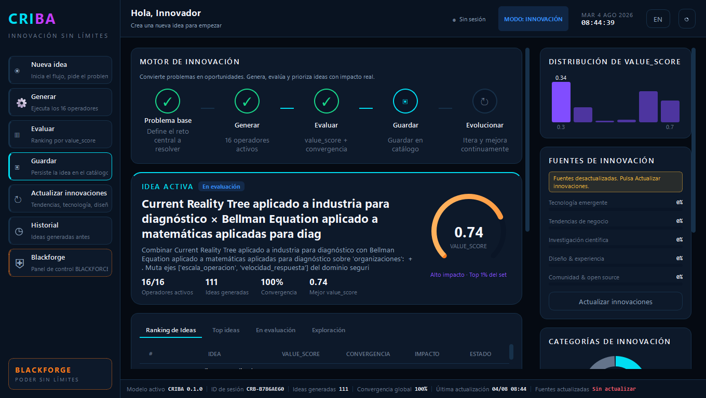
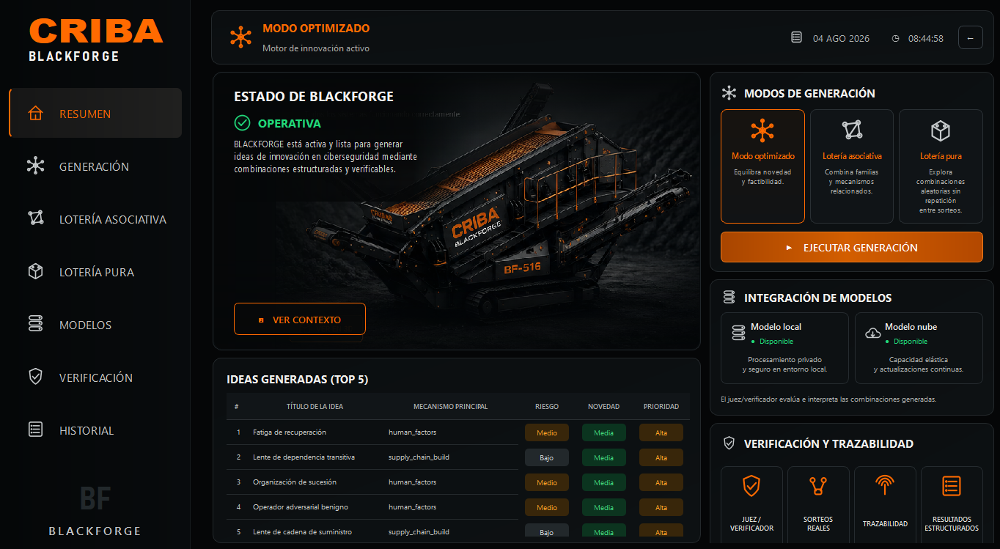

# CRIBA + BLACKFORGE

**Un solo producto para convertir problemas difíciles en ideas comparables,
experimentos concretos y decisiones mejor justificadas.**

CRIBA es la ventana principal. BLACKFORGE es su espacio especializado en
innovación de ciberseguridad. Se entregan juntas, se ejecutan en local y no
necesitan Python, Git, Docker ni una clave de API para el uso básico.

## ⬇️ Descargar el portable para Windows

### [DESCARGAR CRIBA-BLACKFORGE PORTABLE (Windows x64)](https://github.com/klssxx/Criba-Blackforge/releases/latest/download/CRIBA-Blackforge-Portable-Windows-x64.zip)

No se instala: descarga el ZIP, extráelo completo y abre `CRIBA.exe`.

- [Ver la última versión y su SHA-256](https://github.com/klssxx/Criba-Blackforge/releases/latest)
- Requisitos: Windows 10/11 de 64 bits.
- El ZIP incluye CRIBA, BLACKFORGE, la herramienta de consola y guías de primer
  uso en español e inglés.

> Windows puede mostrar SmartScreen la primera vez porque el ejecutable aún no
> está firmado. Comprueba el SHA-256 publicado en la release antes de abrirlo.

## ¿Qué hace CRIBA?

CRIBA ayuda a pensar con método cuando una pregunta tiene demasiadas opciones o
supuestos ocultos:

1. Escribes el problema, idea o decisión que quieres estudiar.
2. CRIBA lo analiza con 16 operadores de innovación y propone alternativas.
3. Compara las ideas por valor, novedad, coste, evidencia y convergencia.
4. Devuelve un ranking y una recomendación práctica: avanzar, ampliar la prueba
   o revisar la propuesta.
5. Puede guardar la sesión para consultarla y compararla después.

No sustituye el criterio humano ni promete que una idea sea verdadera. Su valor
es hacer visibles las alternativas, los supuestos y las pruebas que faltan.



*Captura real de CRIBA: problema procesado, ideas generadas, ranking y métricas.*

## ¿Qué hace BLACKFORGE?

BLACKFORGE aplica el mismo enfoque a retos de ciberseguridad. Combina un catálogo
curado de 723 registros para producir ideas defensivas, estructuradas y
trazables. Permite explorar de tres formas:

- **Modo optimizado:** equilibra novedad y viabilidad.
- **Lotería asociativa:** combina familias y mecanismos relacionados.
- **Lotería pura:** busca combinaciones menos obvias y evita repetir sorteos.

BLACKFORGE no es una herramienta de ataque. Es un laboratorio de ideas para
diseñar controles, experimentos, modelos de amenaza y mejoras de seguridad.



*Captura real de BLACKFORGE: catálogo, modos de generación y trazabilidad.*

## Un producto, dos ventanas

Al pulsar **Blackforge** dentro de CRIBA, la aplicación abre el ejecutable
hermano `BLACKFORGE.exe`. CRIBA se oculta mientras trabajas allí y vuelve al
cerrar BLACKFORGE. Todo forma parte del mismo ZIP y del mismo repositorio.

## Primera prueba en 60 segundos

1. Abre `CRIBA.exe`.
2. Escribe un reto, por ejemplo: *«Reducir fraudes sin empeorar la experiencia
   de clientes legítimos»*.
3. Pulsa **Generar** y después **Evaluar**.
4. Revisa el ranking, la recomendación y las métricas.
5. Pulsa **Blackforge** para explorar el mismo tipo de razonamiento aplicado a
   ciberseguridad.

La guía completa está en `FIRST_RUN_ES.md` dentro del ZIP.

## Para desarrollo

El motor principal está en `src/criba/engine.py`; el pipeline especializado, en
`src/criba/blackforge_pipeline.py`; y las dos interfaces Qt, en
`src/criba/ui/main_window.py` y `src/criba/ui/blackforge_window.py`. La
arquitectura y sus contratos se explican en [docs/ARCHITECTURE.md](docs/ARCHITECTURE.md).

```powershell
# Entorno reproducible
uv sync --all-extras --locked
uv run pytest
uv run mypy src/criba

# Motor CRIBA
uv run criba activate --query "Evaluar una alternativa reversible"

# Pipeline BLACKFORGE reproducible con semilla
uv run criba blackforge --query "Analizar una hipótesis concreta" --seed 11
```

`uv.lock` es la fuente de verdad para las versiones. Los scripts PowerShell
usan primero `CRIBA_PYTHON` si está definido y, si no,
`.venv\Scripts\python.exe`.

## Construir el portable

```powershell
.\scripts\build-portable.ps1
```

El build `onedir` de PyInstaller genera una única carpeta:

```text
dist\CRIBA-Blackforge\
├── CRIBA.exe
├── BLACKFORGE.exe
├── CRIBA-CLI.exe
├── FIRST_RUN_ES.md
├── FIRST_RUN_EN.md
├── THIRD_PARTY_NOTICES.md
├── LICENSE
└── _internal\
```

La release pública ejecuta tests y chequeo de tipos antes de construir el ZIP,
publica su SHA-256, genera un SBOM CycloneDX y verifica su procedencia antes de
subirlo. Los detalles operativos están en
[docs/RELEASE_OPERATIONS.md](docs/RELEASE_OPERATIONS.md).

## Limitaciones conocidas

- La base SQLite se guarda en
  `%LOCALAPPDATA%\CRIBA-Blackforge\criba.sqlite3`.
- El flujo básico funciona en local; los adaptadores de API y MCP no se activan
  por defecto.
- El ejecutable todavía no está firmado, por lo que SmartScreen o el antivirus
  pueden pedir confirmación en el primer uso.

## Licencia

Consulta [LICENSE](LICENSE) y [THIRD_PARTY_NOTICES.md](THIRD_PARTY_NOTICES.md).
