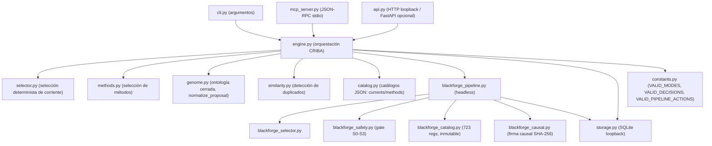

# CRIBA + BLACKFORGE — Arquitectura

Documentación generada en FASE 5 (hardening). Fiel al código en
`src/criba/` verificado en Modal (klssxx): 204 passed, mypy strict
rc=0 sobre 20 archivos.

## Componentes

## Contratos centrales (ratificados)

- `value_score = evidence * novelty / cost` — fórmula de convergencia,
  nunca re-derivada. Implementada en `engine._evaluate_idea`.
- `pipeline_action ∈ {PROTOTIPAR, DIVERGIR}` — separado de
  `recommended_status`. No se infiere ADOPTAR por número de familias.
- `recommended_status ∈ VALID_DECISIONS`
  (`ADOPTAR`, `AMPLIAR PRUEBA`, `ABANDONAR`,
  `ARCHIVAR PARA RECOMBINAR`).
- `packet["ideas"] is packet["innovation"]["ideas"]` — una sola
  colección canónica, sin divergencia posible.

## Flujo CRIBA (`activate`)

1. `selector.select` elige corriente por señales deterministas.
2. `methods.select_methods` elige métodos por familia distinta.
3. `cartograph_and_break` (injectable) cartografía + rupturas.
4. `diverge` genera ideas por recombinación de operadores sobre
   5 ejes causales (Zwicky box).
5. `cross_consistency_assessment` descarta candidatos cosméticos
   (sin eje causal movido).
6. `similarity.classify` marca duplicados/variantes.
7. `_evaluate_idea` puntúa por `value_score` y rankea.
8. `decision` emite `pipeline_action` + `recommended_status`.

## Flujo BLACKFORGE headless (`run_headless`)

1. `blackforge_selector.select_blackforge` — subset reproducible
   del catálogo inmutable (723 regs) respetando cuotas de política.
2. `blackforge_safety.evaluate_blackforge_safety` — gate S0–S3;
   DENY excluye el ítem del set de ideas.
3. Por ítem superviviente: firma causal + convergencia
   (`_evaluate_idea`, misma fórmula que CRIBA).
4. CCA descarta supervivientes sin eje causal (`causal_signature_present`).
5. Rank por `value_score`; emite packet 2.1 + artifacts.

## Inmutabilidad del catálogo

`blackforge_catalog.load()` parsea el JSON una sola vez por proceso,
envuelve cada registro en `MappingProxyType` y construye un índice
O(1) por `blackforge_id`. Nunca expone referencia mutable. Los
tests de regresión verifican deep immutability y rechazo de IDs
vacíos/duplicados.

## Entorno de verificación

Todo pytest / mypy / coverage / benchmark corre EXCLUSIVAMENTE en
Modal cloud (workspace `klssxx`) vía
`.autoregen/cloud/modal_runner.py`. El launcher local es
`C:\Users\KLSX\AppData\Local\Programs\Python\Python312\python.exe`
con `PYTHONUTF8=1`. Nunca se carga la suite en la máquina local.

## Invariantes protegidos

- `gui.py` fuera de alcance (KI-001, SyntaxError preexistente).
- Catálogo canónico: 723 registros, SHA-256
  `1c698d540fbb22d6aa7e2f65bb8e59847109de1d093cfab4de8e817b4eab51cc`.
- Sin regeneración de golden masters semánticos.
